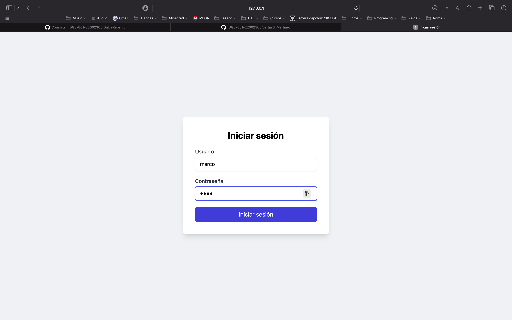

# Flask-Login

Este repositorio contiene un ejemplo práctico de cómo implementar autenticación de usuarios en una aplicación Flask utilizando la extensión `flask-login`. Además, se utiliza **Tailwind CSS** y **Flowbite** para diseñar una interfaz de usuario moderna y responsiva.

---

## Que es Flask-Login?
Flask-Login es una extensión de Flask que facilita la administración de sesiones de usuario y la autenticación en aplicaciones web. Su propósito principal es manejar el inicio y cierre de sesión, recordar a los usuarios en diferentes sesiones y restringir el acceso a ciertas partes de la aplicación según el estado de autenticación del usuario.
Principales características y funcionalidades de Flask-Login
- **Gestión de sesiones:** Mantiene a los usuarios conectados entre diferentes solicitudes.
- **Autenticación de usuarios:** Permite verificar si un usuario ha iniciado sesión o no.
- **Recuperación de usuarios:** Carga automáticamente la información del usuario autenticado.
- **Protección de rutas:** Permite restringir el acceso a ciertas páginas solo para usuarios autenticados.
- **Compatibilidad con múltiples métodos de autenticación:** Se puede combinar con bases de datos, OAuth y otros sistemas de autenticación.


## Descripción

El proyecto incluye:
- Un sistema de autenticación con `flask-login`.
- Rutas protegidas que solo son accesibles para usuarios autenticados.
- Un diseño atractivo y responsivo utilizando **Tailwind CSS** y **Flowbite**.
- Un flujo de inicio de sesión, cierre de sesión y acceso a páginas protegidas.

---

## Instalación

Sigue estos pasos para configurar y ejecutar el proyecto en tu máquina local:

1. Clona este repositorio:
   ```bash
   git clone https://github.com/IDGS-801-22002360/partial3_Martinez.git
   cd flask-login

2. Crea un entorno virtual e instala las dependencias
    ```bash
    python3 -m venv venv
- para **Windows**
    ```bash
    Source venv/Scripts/activate
    pip install -r requirements.txt
    
- Para **MacOs**
    ```bash  
    Source venv/bin/activate
    pip install -r requirements.txt
___

## Funcionalidades principales:
**Inicio de sesión:**
Ingresa con las credenciales de usuario predefinidas
Usuario: marco, Contraseña: 1234
Usuario: user2, Contraseña: 1234

Si las credenciales son correctas, serás redirigido a la página de bienvenida

**Rutas protegidas:**

Las rutas como ***/home*** y ***/protected*** solo son accesibles si el usuario está autenticado.
Si intentas acceder a estas rutas sin iniciar sesión, serás redirigido automáticamente a la página de inicio de sesión.

**Cierre de sesión:**
Solamente hay que hacer click en el boton de "Cerrar secion" para que se cierre la secion del usuario, y una vez hecho el
usuario ya no podra acceder a ninguna de las rutas, en automatico lo redirigira a la pagina de login

## Ejecucion
Primero, cuando ejecutamos la aplicacion nos mandara a la pagina de `Login`
```markdown

